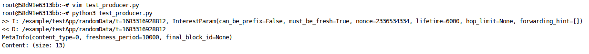

## NDN-DPDK with python-ndn across FABRIC

this notebook/experiment is hosted at https://github.com/jthak002/ndn-fabricv2

Setup incase you do not have your fabric environment setup properly. 


```bash
%%bash 
source ~/work/fabric_config/fabric_rc
printenv | grep FABRIC
```


```python
import os

# Specify your project ID
os.environ['FABRIC_PROJECT_ID']=''

# Set your Bastion username and private key
os.environ['FABRIC_BASTION_USERNAME']=''
os.environ['FABRIC_BASTION_KEY_LOCATION']=os.environ['HOME']+'/work/.ssh/id_rsa'
os.environ['FABRIC_JUPYTER_USERNAME'] = ''
# You can leave the rest on the default settings
# Set the keypair FABRIC will install in your slice. 
os.environ['FABRIC_SLICE_PRIVATE_KEY_FILE']=os.environ['HOME']+'/work/fabric_config/slice_key'
os.environ['FABRIC_SLICE_PUBLIC_KEY_FILE']=os.environ['HOME']+'/work/fabric_config/slice_key.pub'
# Bastion IPs
os.environ['FABRIC_BASTION_HOST'] = 'bastion.fabric-testbed.net'

# make sure the bastion key exists in that location!
# this cell should print True
os.path.exists(os.environ['FABRIC_BASTION_KEY_LOCATION'])

# prepare to share these with Bash so we can write the SSH config file
FABRIC_BASTION_USERNAME = os.environ['FABRIC_BASTION_USERNAME']
FABRIC_BASTION_KEY_LOCATION = os.environ['FABRIC_BASTION_KEY_LOCATION']
FABRIC_SLICE_PRIVATE_KEY_FILE = os.environ['FABRIC_SLICE_PRIVATE_KEY_FILE']
FABRIC_BASTION_HOST = os.environ['FABRIC_BASTION_HOST']
```

## Setting up the instances


```python
from fabrictestbed_extensions.fablib.fablib import FablibManager as fablib_manager
fablib = fablib_manager()
fablib.show_config()
```


```python
import json
import traceback
import os

SLICENAME="<YOUr-SLICENAME-HERE>"
SLICE_EXISTS = False
try:
    fabric_slice = fablib.get_slice(SLICENAME)
    print("You already have a slice named %s." % SLICENAME)
    SLICE_EXISTS = True
    print(slice)
except:
    fabric_slice = fablib.new_slice(name=SLICENAME)
    print("You will need to create a %s slice." % SLICENAME)
```


```python
resources_needed= { 'node1' : {'cpu': 8, 'ram': 80, 'nic': 1, 'disk': 60}, 'node2' : {'cpu': 8, 'ram': 80, 'nic': 1, 'disk': 60}}
site_name = None
try:
    if not SLICE_EXISTS:
        num_nodes = len(resources_needed.keys())
        site_dict_list = fablib.list_sites(output='list', quiet=True)
        for site_dict in site_dict_list:
            print(site_dict['name'] + ', shared_nics_available --> ' + str(site_dict['nic_basic_available']) + ', cpu available--> '+ str(site_dict['cores_available']) + ', ram available --> ' + str(site_dict['ram_available']))
            if (site_dict['nic_basic_available'] > (1 * num_nodes) and site_dict['cores_available'] > (4 * num_nodes) and site_dict['ram_available'] > (80 * num_nodes)):
                site_name = site_dict['name']
                print(f'Site being used will be: {site_name}')
                break
        print(f"A slice does not exist - Will create a new slice with the name {SLICENAME} at site: {site_name}")
    else:
        print(f"A slice does already exists")
except Exception as e:
    print(e)

```


```python
## Our experiment wored exceptionally well at UCSD site
site_name = 'UCSD'
print(f"site_name is being overridden to {site_name} to avoid 500 errors")
```


```python
import sys
import traceback

try:
    if SLICE_EXISTS:
        print("You already have a slice named %s." % SLICENAME)
        fabric_slice = fablib.get_slice(name=SLICENAME)
        for node in fabric_slice.get_nodes():
            print(f"{node}")
    else:
        print(f"creating new nodes and assigning to the slice {SLICENAME}")
        node1 = fabric_slice.add_node(name = 'node1', site=site_name, cores=resources_needed['node1']['cpu'], ram=resources_needed['node1']['ram'], disk=60, image='default_ubuntu_20')
        node2 = fabric_slice.add_node(name = 'node2', site=site_name, cores=resources_needed['node2']['cpu'], ram=resources_needed['node2']['ram'], disk=60, image='default_ubuntu_20')
        ifacenode1 = node1.add_component(model="NIC_Basic", name='if_node_1').get_interfaces()[0]
        ifacenode2 = node2.add_component(model="NIC_Basic", name='if_node_2').get_interfaces()[0]
        net1 = fabric_slice.add_l2network(name='net_1', type='L2Bridge', interfaces=[ifacenode1, ifacenode2])
        fabric_slice.submit()
except Exception as err:
    print(sys.exc_info())
    traceback.print_exc()
```


```python
fabric_slice.list_nodes()
```

### Our Topology

Our FABRIC VM Topology is the following:


### The commands to setup the NDN-DPDK Dependencies and the Program (Manual Via SSH)

This code should run inside the ssh session of the remote server that is initiated by the experimenter. I could have used the fabric primitives to run the commands remotely, but I was not able to get deterministic results everytime i.e. our command would time out in the middle of execution causing the VM to be left in an inconsistent state, which would require us to reprovision the VM. Therefore, we chose to list out the commands in the form of a bash script. You can create a `setup-ndn.sh` bash script in the home directory of your session after SSH-ing into the VM. Provide execute permissions to the script using `chmod 500 setup-ndn.sh` command and then run the script using `./setup-ndn.sh`.

> Run the commands __without__ `sudo` or a `root` shell. It should run within a normal shell under the default ubuntu user provisioned by the fabric VMs; that's the only way `ndndpdk-depends.sh` will work.

```bash
#!/bin/bash
export SELF_DIR=$PWD
sudo apt update
wget http://www.mellanox.com/downloads/ofed/MLNX_OFED-5.8-1.0.1.1/MLNX_OFED_SRC-debian-5.8-1.0.1.1.tgz
tar zxvf MLNX_OFED_SRC-debian-5.8-1.0.1.1.tgz
sudo MLNX_OFED_SRC-5.8-1.0.1.1/./install.pl
git clone https://github.com/usnistgov/ndn-dpdk
git clone https://github.com/DPDK/dpdk
sudo apt install --no-install-recommends -y ca-certificates curl jq lsb-release sudo nodejs
chmod a+x ndn-dpdk/docs/ndndpdk-depends.sh
echo | ndn-dpdk/docs/./ndndpdk-depends.sh
sudo npm install -g pnpm
cd ndn-dpdk/core && pnpm install
cd $SELF_DIR/ndn-dpdk && NDNDPDK_MK_RELEASE=1 make && sudo make install 
cd $SELF_DIR && sudo python3 $SELF_DIR/dpdk/usertools/dpdk-hugepages.py -p 1G --setup 64G
sudo ndndpdk-ctrl systemd start
ndndpdk-ctrl -v
```
#### Test for Successful Execution
run `ndndpdk-ctrl -v` and it should return an output similar to below:
```bash
ndndpdk-ctrl version v0.0.0-20230411150822-eae4b29557ea
```

### Setting up NDN-DPDK as a forwarder

We need to manually program ndn-dpdk to act as a forwarder AND then link the 2 NDN DPDK instances together. After the NDN-DPDK program has been configured to work in the forwarder mode, we need to create `eth-port` and an `eth-face`. The creation of the `eth-port` assigns the shared-nic present on the system to be controlled by the DPDK program using one of the `pci`, `A_NET` or the `XDP` drivers (the commands below chose the `PCI` driver since it is the fastest and also the one compatible with the NVIDIA Mellanox Connect-X6 cards used in FABRIC [Network Hardware](https://learn.fabric-testbed.net/knowledge-base/network-interfaces-in-fabric-vms/)). One `eth-port` instance can be associated with multiple `eth-iface` instances. The `eth-face` is a generalization of a network interface, which is used by NDN-DPDK programs to connect and forward application. more here: [https://github.com/usnistgov/ndn-dpdk/blob/main/docs/face.md](https://github.com/usnistgov/ndn-dpdk/blob/main/docs/face.md).
Think of each `eth-face` as a dedicated connection to the other node. We have to run the following commands on every pair of NDN-DPDK instances that we want to connect to each other. The `echo {} | ndndpdk-ctrl activate-forwarder` command only has to be run once per VM. The rest of the commands have to be every time a new `face` is added to the instance that is running the NDN-DPDK program. 
```bash
echo {} | ndndpdk-ctrl activate-forwarder
sudo ndndpdk-ctrl create-eth-port --pci <INTERFACE INDEX> # replace <interface index> with the following format
sudo ndndpdk-ctrl create-ether-face --local <LOCAL INTERFACE MAC> --remote <OTHER NODES INTERFACE MAC> # replace with mac address of local ConnectX6 interface  and mac address of remote ConnectX6 interface. 
```
We will need to save the output of the IDs generated by each of these commands. We will refer to them as `$NODE1_IFACEID` and `NODE2_IFACEID` from now on. It would be helpful to save these into __persistent__ environment viariables on both the servers from now on.    

> __Note:__ Now or in the future if the `ndndpdk-ctrl create-{ether-/udp-/-}face` commands fail please restart the ndn-dpdk service. Failed create-face commands leave the the NDN-DPDK instance in an inconsistent state, and restarting the system service resolves that. 
>> __finding the interface index:__ In order to find the `<INTERFACE INDEX>` for the `--pci` driver to work use the `lspci` command in the FABRIC VMs Shell. In our experience it is always at location `00:07.00` under the name `Mellanox Technologies MT28908 Family [ConnectX-6 Virtual Function]` as shown in the output below:
```bash
    ubuntu@df286671-d1dd-42bc-90fe-f78324a8a0e6-node1:~$ lspci
    00:00.0 Host bridge: Intel Corporation 440FX - 82441FX PMC [Natoma] (rev 02)
    00:01.0 ISA bridge: Intel Corporation 82371SB PIIX3 ISA [Natoma/Triton II]
    00:01.1 IDE interface: Intel Corporation 82371SB PIIX3 IDE [Natoma/Triton II]
    00:01.2 USB controller: Intel Corporation 82371SB PIIX3 USB [Natoma/Triton II] (rev 01)
    00:01.3 Bridge: Intel Corporation 82371AB/EB/MB PIIX4 ACPI (rev 03)
    00:02.0 VGA compatible controller: Cirrus Logic GD 5446
    00:03.0 Ethernet controller: Red Hat, Inc. Virtio network device
    00:04.0 SCSI storage controller: Red Hat, Inc. Virtio block device
    00:05.0 Unclassified device [00ff]: Red Hat, Inc. Virtio memory balloon
    00:06.0 Unclassified device [00ff]: Red Hat, Inc. Virtio RNG
    00:07.0 Ethernet controller: Mellanox Technologies MT28908 Family [ConnectX-6 Virtual Function]
```
>>__finding the mac address:__ the mac address can be found using the `ifconfig` command and looking at the mac address of the interface associated with the ConnectX6 NIC. it has usually been named `ens7np0` for out experiments. it is also the interface that should show the status `DOWN`.

#### Testing for successful execution
We can test if the NDN-DPDK instances are running by running the following commands. on `node2` we will run the the ping server provided by NDN-DPDK package itself, while the `node1` acts as the client. the NDN-DPDK program includes the `ndndpdk-godemo` which simulates both the server and client. 
First we will feed the the FIB entry in `node1` by running the following command:

```bash
ndndpdk-ctrl insert-fib --name /example/Ping --nh $NODE1_IFACEID
```

The command creates a Forwarding Information Base (FIB) Entry in the NDN-DPDK forwarder by telling it to forward the interests that it receives with the name `/testNode2/Ping` to the next-hop (`--nh`, get it?) address referenced by the `eth-face` ID we created in the earlier step. Then on `node2` start the pingserver process that's included in the ndndpdk-godemo binary - this should start a producer which produces dummy packets for the name `/example/Ping`.
```bash
ndndpdk-godemo pingserver --name /example/Ping
```
Next we start the `pingclient` process on `node1` to send to the namespace `/example/Ping`.

```bash
ndndpdk-godemo pingserver --name /example/Ping
```

The output on `node1` is shown below: 
```bash
ubuntu@df286671-d1dd-42bc-90fe-f78324a8a0e6-node1:~$ ndndpdk-godemo pingclient --name /example/Ping
2023/05/05 00:52:23 uplink opened, state is down
2023/05/05 00:52:23 uplink state changes to up
2023/05/05 00:52:23 100.00% D F2AA3C9E08A38326   7853us
2023/05/05 00:52:23 100.00% D F2AA3C9E08A38327   8028us
2023/05/05 00:52:23 100.00% D F2AA3C9E08A38328   8021us
2023/05/05 00:52:23 100.00% D F2AA3C9E08A38329   6944us
2023/05/05 00:52:23 100.00% D F2AA3C9E08A3832A   6688us
2023/05/05 00:52:23 100.00% D F2AA3C9E08A3832B    830us
2023/05/05 00:52:23 100.00% D F2AA3C9E08A3832C   1090us
2023/05/05 00:52:23 100.00% D F2AA3C9E08A3832D   1196us
2023/05/05 00:52:24 100.00% D F2AA3C9E08A3832E   1513us
2023/05/05 00:52:24 100.00% D F2AA3C9E08A3832F    804us
2023/05/05 00:52:24 100.00% D F2AA3C9E08A38330   1025us
2023/05/05 00:52:24 100.00% D F2AA3C9E08A38331   1366us
2023/05/05 00:52:24 100.00% D F2AA3C9E08A38332   1512us
2023/05/05 00:52:24 100.00% D F2AA3C9E08A38333   1784us
2023/05/05 00:52:24 100.00% D F2AA3C9E08A38334   2170us
2023/05/05 00:52:24 100.00% D F2AA3C9E08A38335   1377us
2023/05/05 00:52:24 100.00% D F2AA3C9E08A38336    732us
2023/05/05 00:52:24 100.00% D F2AA3C9E08A38337    953us
2023/05/05 00:52:25 100.00% D F2AA3C9E08A38338   1224us
2023/05/05 00:52:25 100.00% D F2AA3C9E08A38339   1540us
2023/05/05 00:52:25 100.00% D F2AA3C9E08A3833A    672us
^C2023/05/05 00:52:25 uplink state changes to down
2023/05/05 00:52:25 uplink closed, error is <nil>
```

The output on `node2` is shown below: 

```bash
ubuntu@a256c903-4c24-4ac7-af1c-53ed6dcaefa3-node2:~$ ndndpdk-godemo pingserver --name /example/Ping
2023/05/05 00:51:28 uplink opened, state is down
2023/05/05 00:51:28 uplink state changes to up
2023/05/05 00:52:23 /8=example/8=Ping/8=F2AA3C9E08A38326[F]
2023/05/05 00:52:23 /8=example/8=Ping/8=F2AA3C9E08A38327[F]
2023/05/05 00:52:23 /8=example/8=Ping/8=F2AA3C9E08A38328[F]
2023/05/05 00:52:23 /8=example/8=Ping/8=F2AA3C9E08A38329[F]
2023/05/05 00:52:23 /8=example/8=Ping/8=F2AA3C9E08A3832A[F]
2023/05/05 00:52:23 /8=example/8=Ping/8=F2AA3C9E08A3832B[F]
2023/05/05 00:52:23 /8=example/8=Ping/8=F2AA3C9E08A3832C[F]
2023/05/05 00:52:23 /8=example/8=Ping/8=F2AA3C9E08A3832D[F]
2023/05/05 00:52:24 /8=example/8=Ping/8=F2AA3C9E08A3832E[F]
2023/05/05 00:52:24 /8=example/8=Ping/8=F2AA3C9E08A3832F[F]
2023/05/05 00:52:24 /8=example/8=Ping/8=F2AA3C9E08A38330[F]
2023/05/05 00:52:24 /8=example/8=Ping/8=F2AA3C9E08A38331[F]
2023/05/05 00:52:24 /8=example/8=Ping/8=F2AA3C9E08A38332[F]
2023/05/05 00:52:24 /8=example/8=Ping/8=F2AA3C9E08A38333[F]
2023/05/05 00:52:24 /8=example/8=Ping/8=F2AA3C9E08A38334[F]
2023/05/05 00:52:24 /8=example/8=Ping/8=F2AA3C9E08A38335[F]
2023/05/05 00:52:24 /8=example/8=Ping/8=F2AA3C9E08A38336[F]
2023/05/05 00:52:24 /8=example/8=Ping/8=F2AA3C9E08A38337[F]
2023/05/05 00:52:25 /8=example/8=Ping/8=F2AA3C9E08A38338[F]
2023/05/05 00:52:25 /8=example/8=Ping/8=F2AA3C9E08A38339[F]
2023/05/05 00:52:25 /8=example/8=Ping/8=F2AA3C9E08A3833A[F]

^C2023/05/05 01:01:33 uplink closed, error is <nil>
```

### Installing an alternate version of python on the FABRIC VM \[For Using Python NDN\]
We have used ubuntu 20.04 lts version as our OS - but we need python>=3.9 to compile the newest version of the `python-ndn` library from the source. Ubuntu 20.04 (focal) only ships with pythonv3.8 - and we need python 3.11 so we perform the following steps. 
```bash
sudo add-apt-repository ppa:deadsnakes/ppa
# then press enter to agree to add the repository
sudo apt install python3.11
# now you can call python3.11 by explicitly using python3.11 command. don't use python3 or python which will call the legacy version of pyhton.
curl https://bootstrap.pypa.io/get-pip.py -o get-pip.py
python3.11 get-pip.py
# this will install pip version compatible with python3.11 in your /home/${USER}/.local/bin directory we need to add this to the path
# CAUTION: This step has to be performed EVERY TIME you open the terminal/New session. If you don't want to do that add it to your PATH
# using export PATH="$PATH:/home/ubuntu/.local/bin" command in the end of your .bashrc in the home directory.
export PATH="$PATH:/home/ubuntu/.local/bin"
# Call pip using pip3.11
pip3.11 --version
# call python using python3.11
python3.11 --version
```

Now we install the python-ndn package using pip on both the VMs. 
```bash
pip3.11 install 
```

### Install Docker Engine and Fetching the NFD Image

The authors of NDN DPDK recommend we run the NFD as a We can install the Docker Engine application on the servers using the following commands:
```bash
sudo apt-get update && \
sudo apt-get install  ca-certificates curl gnupg && \
sudo install -m 0755 -d /etc/apt/keyrings && \
curl -fsSL https://download.docker.com/linux/ubuntu/gpg | sudo gpg --dearmor -o /etc/apt/keyrings/docker.gpg && \
sudo chmod a+r /etc/apt/keyrings/docker.gpg && \
echo "deb [arch="$(dpkg --print-architecture)" signed-by=/etc/apt/keyrings/docker.gpg] https://download.docker.com/linux/ubuntu \
"$(. /etc/os-release && echo "$VERSION_CODENAME")" stable" | sudo tee /etc/apt/sources.list.d/docker.list > /dev/null && \
sudo apt-get update && \
sudo apt-get install docker-ce docker-ce-cli containerd.io docker-buildx-plugin docker-compose-plugin && \
sudo usermod -aG docker ${USER}
```
#### Test for successful execution
Then we can download the `hello-world` docker image to check if it's working fine!
```bash
sudo docker run hello-world
```


### Setting up the NFD Container
Now we need to download the image needed to make NFD work. The authors of NDN-DPDK suggest using a dockerized image of NFD so it can function in isolation from the other packages, which prevents a lot of the common errors that occur because of mismatched or interfering dependencies.

Go back to the directory where the `ndn-dpdk` folder has been cloned - It should most probably be the home directory.
```bash
sudo docker build --pull -t nfd ndn-dpdk/docs/interop/nfd/.
```
You should get an output similar to what is shown below - The key part in this output is that it is built using the `debian:bullseye` base image; which means it has a stripped down version of debian and accompanying programs, which needed to initialize a shell that we can use to develop our stub program. 
```bash
[+] Building 61.1s (9/9) FINISHED                                                                                                           
 => [internal] load build definition from Dockerfile                                                                                        
 => => transferring dockerfile: 611B                                                                                                        
 => [internal] load .dockerignore                                                                                                           
 => => transferring context: 2B                                                                                                             
 => [internal] load metadata for docker.io/library/debian:bullseye                                                                           
 => [1/4] FROM docker.io/library/debian:bullseye@sha256:63d62ae233b588d6b426b7b072d79d1306bfd02a72bff1fc045b8511cc89ee09                   
 => => resolve docker.io/library/debian:bullseye@sha256:63d62ae233b588d6b426b7b072d79d1306bfd02a72bff1fc045b8511cc89ee09                   
 => => sha256:63d62ae233b588d6b426b7b072d79d1306bfd02a72bff1fc045b8511cc89ee09 1.85kB / 1.85kB                                             
 => => sha256:32888a3c745e38e72a5f49161afc7bb52a263b8f5ea1b3b4a6af537678f29491 529B / 529B                                                 
 => => sha256:34b4fa67dc04381e908b662ed69b3dbe8015fa723a746c66cc870a5330520981 1.46kB / 1.46kB                                             
 => => sha256:918547b9432687b1e1d238e82dc1e0ea0b736aafbf3c402eea98c6db81a9cb65 55.05MB / 55.05MB                                           
 => => extracting sha256:918547b9432687b1e1d238e82dc1e0ea0b736aafbf3c402eea98c6db81a9cb65                                                  
 => [internal] load build context                                                                                                          
 => => transferring context: 1.19kB                                                                                                        
 => [2/4] RUN apt-get -y -qq update  && apt-get -y -qq install --no-install-recommends ca-certificates  && echo "deb [arch=amd64 tr..." 35.2s
 => [3/4] COPY start.sh /                                                                                                                  
 => [4/4] RUN chmod +x /start.sh  && setcap -r /usr/bin/nfd || true  && echo 'transport=unix:///run/ndn/nfd.sock' > /etc/ndn/client.conf   
 => exporting to image                                                                                                                     
 => => exporting layers                                                                                                                    
 => => writing image sha256:8d7310a705391d6aa1127b0a9314d0d85e91a8d3851de22a401f5a8c73f95216                                               
 => => naming to docker.io/library/nfd                                                                                                      
```
This should build and download the latest nightly container image of the NFD program. We will now initialize a container using the following command. We include the `--init` parameter because we want the container process to run under a init process. An init process has a PID 1 in the container. Specifying an init process ensures the usual responsibilities of an init system, such as reaping zombie processes, are performed inside the created container. 
```bash
docker volume create run-ndn
docker run -d --name nfd --network none --init --mount type=volume,source=run-ndn,target=/run/ndn -e 'NFD_CS_CAP=1024' nfd
```
> __Note:__ The Environment inside the docker container is __ephemeral__; which means all the data in it will be lost if the container stops or restarts. So make sure the changes made inside the container are stored somewhere safe, or mount volumes. 
#### Test for successful execution
Now we check the status of our container using the `docker container ls` command -  you should see the nfd container running on the host.
```bash
ubuntu@8c853b4b-ad84-4676-895d-e636f5665705-node1:~$ docker container ls 
CONTAINER ID   IMAGE     COMMAND       CREATED       STATUS       PORTS     NAMES
1bb1d3e24bc2   nfd       "/start.sh"   2 hours ago   Up 2 hours             nfd
```
If we want to open a shell we use the `docker exec -it nfd /bin/bash` command. This command runs a bash shell inside your container.

### Exposing the NFD Socket in the container for NDN-DPDK and `python-ndn` to access

We will now mount the socket that is running in the `/run/ndn` location of the NFD container and expose it on the host which is running the container, the NDN-DPDK program and will run the python program as well. 

We will first take a look at the `run-ndn` doocker volume which we created for the container on each host - we should run the `docker volume inspect run-ndn` command which should give us the __actual directory on the disk of the container host__, which is mounted in the `/run/ndn` location inside container. That directory has the `nfd.sock` object - which is the nfd socket. We need to mount that directory in the `/run/ndn` of our container/NDN-DPDK host. 

```bash
# output of docker volume inspect - we can the directory /var/lib/docker/volumes/run-ndn/_data is the directory mounted in /run/ndn

    {
        "CreatedAt": "2023-05-04T16:54:42Z",
        "Driver": "local",
        "Labels": null,
        "Mountpoint": "/var/lib/docker/volumes/run-ndn/_data",
        "Name": "run-ndn",
        "Options": null,
        "Scope": "local"
    }
]
```

Now we mount that directory in the `/run/ndn` directory of the our FABRIC VMs. 

```bash
sudo mkdir -p /run/ndn
sudo mount --bind $(docker volume inspect -f '{{.Mountpoint}}' run-ndn) /run/ndn
```

> Note: This mount is emphemeral - will not persist across system reboots. If you want a permanent mount look into adding the entry into `/etc/fstab` along with making sure the docker container starts before the mount happens otherwise the `/etc/fstab` mount will fail.

#### Test for successful execution
Once the docker volume has been mounted on the `/run/ndn`, you should see the `nfd.sock` file once you run `ls -lh /run/ndn`.


### Setting up the Server Nodes
We will be using the `node1` as a client and `node2` as the server. our server program will serve the `/huffpost/article` namespace. the topology is shown below:


In order to achieve this we will have to make sure the requests originating form the consumer process on node 2 travel through the NFD to the NDN-DPDK instance on `node2` to `node1` upstream and then to the NFD instance on `node1`,  which then passes it to the producer python application.
#### Registering the NFD Process with NDN-DPDK.
WE need to register the NFD instances with NDN-DPDK forwarders. WE can think of the NFD instances as customer routers with reduced capacity and speed, while the NDN-DPDK forwarders make up the core of the network. 
```bash
jq -n '{scheme: "unix", remote:"/run/ndn/nfd.sock"}' | ndndpdk-ctrl create-face
```
save the output ID of this command as `NODE1_NFD_FACEID` and `NODE2_NFS_FACEID` when running on both nodes. Once this is done we can check if the connection was successful by setting up a server process inside the NFD container on `node1` for a sample ping, and send a ping from the NFD container in node 2 to the NFD container in node 1. lets set up a series of next hop paths from NFD_Node2 --> NDN-DPDK_Node2 --> NDN-DPDK_Node1 --> NFD_Node1. We will use the `ndnping` and `ndnpingserver` commands (provided with the NFD containers) inside the Node2 NFD Container and Node 1 NFD Container respectively. Out ping name for the FIB will be `/example/Ping2` 

> __Hint:__ if you forgot to set the environment variables for the `eth-faces` you can always retrieve them using the `ndndpdk-ctrl list-face` command

```bash
# register the route on the NDN-DPDK2 to NDN-DPDK Node 1 route.
ndndpdk-ctrl insert-fib --name /example/Ping2 --id $NODE2
# register the route on the NDN-DPDK node1 to NFD Node 1 route.
ndndpdk-ctrl insert-fib --name /example/Ping2 --id $NODE1_NFD_IFACEID
```

Now we start the the `ndnpingserver` in the NFD container on `node1`.
```bash
# activate the NFD container on node1 - might need sudo if you are not part of docker group
docker exec -it nfd /bin/bash
# run the ping server with the namespace /example/Ping2
ndnpingserver --size 512 /example/Ping2
```
Now we start the `ndnping` application inside the NFD container on `node2`; However, there is an extra step. How does the NFD container on `node2` know to forward the packet from inside the container to the NDN-DPDK application? For this we first register the `eth-face` between NDN-DPDK on node2 to route NDN packets from the NDN-DPDK on `node2` to the NFD container; the packets will be addressed to the `/localhost/nfd` namespace; This is because the prefix registerer in the NFD container is able to accept packets over the network - once we do that we use the `ndndpdk-godemo` application to register the prefix using the `nfdreg` subroutine:
```bash
# registering the prefix in the fib of node2 to connect to the NFD's prefix regieterer.
ndndpdk-ctrl insert-fib --name /localhost/nfd --nh $NODE2_NFD_IFACEID
# register the prefix to /example/Ping2 as going through node2 NDN-DPDK 
# - basically just setting the next hop address for /example/Ping2 to the interface through which this packet is received.
ndndpdk-godemo nfdreg --command /localhost/nfd --origin 0 --register /example/Ping2
```
A successful registration should show the following output.
```bash
ubuntu@a256c903-4c24-4ac7-af1c-53ed6dcaefa3-node2:/run/ndn$ ndndpdk-godemo nfdreg --command /localhost/nfd --origin 0 --register /example/Ping2
2023/05/05 03:02:15 uplink opened, state is down
2023/05/05 03:02:15 uplink state changes to up
2023/05/05 03:02:17 200 nfdmgmt.RibRegisterCommand {"name":"/8=example/8=Ping2","origin":0,"cost":0,"noInherit":true,"capture":true}
2023/05/05 03:02:18 uplink closed, error is <nil>
```

NOw we activate the `ndnping` command:
```bash
# activate the NFD container on node2 - might need sudo if you are not part of docker group
docker exec -it nfd /bin/bash
# run the ping server with the namespace /example/Ping2
ndnping --size 512 /example/Ping2
```

A successful output is as follows:
```bash
# on node1 NFD - The ping-ee
ubuntu@df286671-d1dd-42bc-90fe-f78324a8a0e6-node1:/run/ndn$ docker exec -it nfd /bin/bash
root@d4869c55680b:/# ndnpingserver --size 512 /example/Ping2
PING SERVER /example/Ping2
interest received: seq=6812403586528848708
interest received: seq=6812403586528848709
interest received: seq=6812403586528848710
interest received: seq=6812403586528848711
interest received: seq=6812403586528848712
interest received: seq=6812403586528848713
interest received: seq=6812403586528848714
...
```

```bash
# on node2 NFD - The ping-er
ubuntu@a256c903-4c24-4ac7-af1c-53ed6dcaefa3-node2:/run/ndn$ docker exec -it nfd /bin/bash
root@63393ce4a3da:/# ndnping -i 10 /example/Ping2
PING /example/Ping2
content from /example/Ping2: seq=6812403586528848708 time=2.75585 ms
content from /example/Ping2: seq=6812403586528848709 time=0.413672 ms
content from /example/Ping2: seq=6812403586528848710 time=0.389707 ms
content from /example/Ping2: seq=6812403586528848711 time=0.403603 ms
content from /example/Ping2: seq=6812403586528848712 time=0.404986 ms
content from /example/Ping2: seq=6812403586528848713 time=0.365221 ms
content from /example/Ping2: seq=6812403586528848714 time=0.408753 ms
content from /example/Ping2: seq=6812403586528848715 time=0.405627 ms
...
```

This demonstrates end-to-end connectivity between NFD instances.


### Simple Producer and Consumer bind to the NFD node.

#### Difficulties encountered while creating the program
- Finding the **correct** sample programs was a bit difficult because the documentation for python-ndn is out of date (latest release as of 05/05/23 is version:v0.3-1). The actual sample code is tucked away in their [repository](https://github.com/named-data/python-ndn/tree/master/examples/appv2/basic_packets). This is the sample code on the README docs website [https://python-ndn.readthedocs.io/en/latest/src/readme.html](https://python-ndn.readthedocs.io/en/latest/src/readme.html).
- Moreover, the last release hosted on `pip` does not include the `appv2` class, which actually supports the PIT token - We would have to install from source using the `pip3 install -U -U git+https://github.com/named-data/python-ndn.git`, and use the `appv2` version of the `NDNApp` to make it work with our setup.
- Another issue we faced once we got the code working was that it could not find the keystore - `pib.db` sqlite3 file, which has the keystore for verifying the authenticity of the packets. We got around that error system by looking for the [`pib.db`](https://github.com/named-data/python-ndn/blob/master/examples/lvs/pib.db) file in their code, and found one that seems to work.

#### Modifying the NFD Docker Image v1.0
> Requires Docker Engine to be installed on your FABRIC VM, and a already built `nfd` docker image from the earlier section.

> __Disclaimer:__ Bundling these tools into a production container image is frowned upon; It makes them bulky, and outdated packages (because of the immutable nature of container images) often increase the attack surface of a container. However, our objective is a experiment so it is for fine now.

We will modify the stock docker image that is given to us from the NDN-DPDK NFD interop section and we will modify it modify the docker image to include the `python` binaries, the `pip` python package manager, `git` and text editor for debugging our code.

```Dockerfile
FROM nfd:latest

RUN apt-get update -y
RUN apt-get install -y python3 python3-dev python3-pip less vim nano
RUN apt-get install -y git wget
RUN pip3 install -U git+https://github.com/named-data/python-ndn.git
```

Then build the container using the `docker build -t nfdv2:test` command and run the container using the same set. Go into the container using `docker exec -it nfdv2 /bin/bash` to start testing and developing our script.
#### The Sample Producer Code

Our sample producer code is shown here. it is a very straightforward implementation, and might also look familiar to someone who has used [Flask](https://flask.palletsprojects.com/en/2.3.x/) or [Django](https://www.djangoproject.com/). We register a handler for the prefix `/example/TestApp` prefix, and everytime the NFD instance receives an interest packet destined for that prefix, it forwards it to the handler. The Handler prints the Interest onto the screen, and then generates a `Hello World` binary encoded response for the requester. 

```python
# -----------------------------------------------------------------------------
# Copyright (C) 2019-2022 The python-ndn authors
#
# This file is part of python-ndn.
#
# Licensed under the Apache License, Version 2.0 (the "License");
# you may not use this file except in compliance with the License.
# You may obtain a copy of the License at
#
#     http://www.apache.org/licenses/LICENSE-2.0
#
# Unless required by applicable law or agreed to in writing, software
# distributed under the License is distributed on an "AS IS" BASIS,
# WITHOUT WARRANTIES OR CONDITIONS OF ANY KIND, either express or implied.
# See the License for the specific language governing permissions and
# limitations under the License.
# -----------------------------------------------------------------------------
import typing
import logging
from ndn import appv2
from ndn import encoding as enc


logging.basicConfig(format='[{asctime}]{levelname}:{message}',
                    datefmt='%Y-%m-%d %H:%M:%S',
                    level=logging.INFO,
                    style='{')


app = appv2.NDNApp()
keychain = app.default_keychain()


@app.route('/example/testApp')
def on_interest(name: enc.FormalName, _app_param: typing.Optional[enc.BinaryStr],
                reply: appv2.ReplyFunc, context: appv2.PktContext):
    print(f'>> I: {enc.Name.to_str(name)}, {context["int_param"]}')
    content = "Hello, world!".encode()
    reply(app.make_data(name, content=content, signer=keychain.get_signer({}),
                        freshness_period=10000))
    print(f'<< D: {enc.Name.to_str(name)}')
    print(enc.MetaInfo(freshness_period=10000))
    print(f'Content: (size: {len(content)})')
    print('')


if __name__ == '__main__':
    app.run_forever()
```

#### The sample consumer code.

The Sample consumer code is shown below - It is pretty simple in functionality; sends out a a interest packet to the prefix `/example/testApp` but appended with `randomData/<timestamp>` suffix.

```bash
# -----------------------------------------------------------------------------
# Copyright (C) 2019-2022 The python-ndn authors
#
# This file is part of python-ndn.
#
# Licensed under the Apache License, Version 2.0 (the "License");
# you may not use this file except in compliance with the License.
# You may obtain a copy of the License at
#
#     http://www.apache.org/licenses/LICENSE-2.0
#
# Unless required by applicable law or agreed to in writing, software
# distributed under the License is distributed on an "AS IS" BASIS,
# WITHOUT WARRANTIES OR CONDITIONS OF ANY KIND, either express or implied.
# See the License for the specific language governing permissions and
# limitations under the License.
# -----------------------------------------------------------------------------
import logging
from ndn import utils, appv2, types
from ndn import encoding as enc


logging.basicConfig(format='[{asctime}]{levelname}:{message}',
                    datefmt='%Y-%m-%d %H:%M:%S',
                    level=logging.INFO,
                    style='{')


app = appv2.NDNApp()


async def main():
    try:
        timestamp = utils.timestamp()
        name = enc.Name.from_str('/example/testApp/randomData') + [enc.Component.from_timestamp(timestamp)]
        print(f'Sending Interest {enc.Name.to_str(name)}, {enc.InterestParam(must_be_fresh=True, lifetime=6000)}')
        # TODO: Write a better validator
        data_name, content, pkt_context = await app.express(
            name, validator=appv2.pass_all,
            must_be_fresh=True, can_be_prefix=False, lifetime=6000, no_signature=True)

        print(f'Received Data Name: {enc.Name.to_str(data_name)}')
        print(pkt_context['meta_info'])
        print(bytes(content) if content else None)
    except types.InterestNack as e:
        print(f'Nacked with reason={e.reason}')
    except types.InterestTimeout:
        print(f'Timeout')
    except types.InterestCanceled:
        print(f'Canceled')
    except types.ValidationFailure:
        print(f'Data failed to validate')
    finally:
        app.shutdown()


if __name__ == '__main__':
    app.run_forever(after_start=main())
```

#### But it still doesn't work - WHY?!
Running `python test_producer.py` does successfully start up the producer, and we even see the producer propogate the routes to the NFD process as shown in the log entries (you can view them using `docker logs nfdv2 --follow`) below:
```bash
1683301433.582420  INFO: [nfd.FaceTable] Added face id=258 remote=fd://18 local=unix:///run/ndn/nfd.sock
1683301433.582996  INFO: [nfd.RibManager] Adding route /example/testApp nexthop=258 origin=app cost=0
1683302260.817791  INFO: [nfd.Transport] [id=258,local=unix:///run/ndn/nfd.sock,remote=fd://18] setState UP -> CLOSING
```
but when we run the `python test_consumer.py` the program crashes with the following output:
```bash
root@58d91e6313bb:~# python3 test_consumer.py 
Sending Interest /example/testApp/randomData/t=1683316076190, InterestParam(can_be_prefix=False, must_be_fresh=True, nonce=None, lifetime=6000, hop_limit=None, forwarding_hint=[])
Timeout
[2023-05-05 19:48:02]INFO:Manually shutdown
```
and the producer was not doing any better - the output on the producer side was as follows:
```bash
root@58d91e6313bb:~# python3 test_producer.py 
>> I: /example/testApp/randomData/t=1683318604389, InterestParam(can_be_prefix=False, must_be_fresh=True, nonce=3374275792, lifetime=6000, hop_limit=None, forwarding_hint=[])
[2023-05-05 20:30:04]ERROR:Task exception was never retrieved
future: <Task finished name='Task-6' coro=<NDNApp._on_interest.<locals>.submit_interest() done, defined at /usr/local/lib/python3.9/dist-packages/ndn/appv2.py:360> exception=KeyError(b'\x07(\x08\x08lvs-test\x08\x06author\x08\x05xinyu\x08\x03KEY\x08\x08\x18\xf9\xa7CP\xf6\xbd\x1b')>
Traceback (most recent call last):
  File "/usr/local/lib/python3.9/dist-packages/ndn/appv2.py", line 372, in submit_interest
    node.callback(name, app_param, reply, context)
  File "/root/test_producer.py", line 43, in on_interest
    reply(app.make_data(name, content=content, signer=keychain.get_signer({}),
  File "/usr/local/lib/python3.9/dist-packages/ndn/security/keychain/keychain_sqlite3.py", line 639, in get_signer
    signer = self.tpm.get_signer(key_name, key_locator_name)
  File "/usr/local/lib/python3.9/dist-packages/ndn/security/tpm/tpm_file.py", line 49, in get_signer
    raise KeyError(key_name)
KeyError: b'\x07(\x08\x08lvs-test\x08\x06author\x08\x05xinyu\x08\x03KEY\x08\x08\x18\xf9\xa7CP\xf6\xbd\x1b'
```
After 3 hours of painful troubleshooting we discovered that our issue was with the `pib.db` file that we provided. Our workaround did not work after all. The entity that signed the data packet for the consumer - The producer could not find a key within the `pib.db` file that we gave it. Setting the `signer=None`(inspired by https://github.com/named-data/python-ndn/issues/25) alleviated the issue but the NFD forwarder dropped responses that were unsigned (as shown here).
```bash
1683314514.410371  INFO: [nfd.FaceTable] Added face id=272 remote=fd://19 local=unix:///run/ndn/nfd.sock
1683314514.418431  WARN: [nfd.GenericLinkService] [id=271,local=unix:///run/ndn/nfd.sock,remote=fd://18] packet parse error (SignatureInfo element is missing): DROP
1683314520.414624  INFO: [nfd.Transport] [id=272,local=unix:///run/ndn/nfd.sock,remote=fd://19] setState UP -> CLOSING
1683314520.414663  INFO: [nfd.Transport] [id=272,local=unix:///run/ndn/nfd.sock,remote=fd://19] setState CLOSING -> CLOSED
```
However, we came across another issue (completely  by accident - because I was reading through the issues out of frustration and desperation) where the user was facing a similar error - https://github.com/named-data/python-ndn/issues/28. They direct the user to another page which is not really helpful as it is the definition of another standard in NDN Spec; However, they mention that you can try with a SHA256 Digest of the message if you don't want to sign with a key - but the suggestion is not accomapnied by a link to the doc. So we perform a plaintext search on the docs hosted on the readme site and come across the [`KeychainDigest`](https://python-ndn.readthedocs.io/en/latest/src/security/security.html#module-ndn.security.keychain.keychain_digest) class, which can help us bypass the NFDs SHA256 signature requirement.

#### Sample Producer and Consumer Code v.2.0

test_producer.py
```bash
import typing
import logging
from ndn import appv2
from ndn import encoding as enc
from ndn.security.keychain.keychain_digest import KeychainDigest


logging.basicConfig(format='[{asctime}]{levelname}:{message}',
                    datefmt='%Y-%m-%d %H:%M:%S',
                    level=logging.INFO,
                    style='{')


app = appv2.NDNApp()
keychain = KeychainDigest()
signer = keychain.get_signer({})


@app.route('/example/testApp')
def on_interest(name: enc.FormalName, _app_param: typing.Optional[enc.BinaryStr],
                reply: appv2.ReplyFunc, context: appv2.PktContext):
    print(f'>> I: {enc.Name.to_str(name)}, {context["int_param"]}')
    content = "Hello, world!".encode()
    reply(app.make_data(name, content=content, signer=signer,
                        freshness_period=10000))
    print(f'<< D: {enc.Name.to_str(name)}')
    print(enc.MetaInfo(freshness_period=10000))
    print(f'Content: (size: {len(content)})')
    print('')


if __name__ == '__main__':
    app.run_forever()
```
test_consumer.py
```bash
async def main():
    try:
        timestamp = utils.timestamp()
        name = enc.Name.from_str('/example/testApp/randomData') + [enc.Component.from_timestamp(timestamp)]
        print(f'Sending Interest {enc.Name.to_str(name)}, {enc.InterestParam(must_be_fresh=True, lifetime=6000)}')
        # TODO: Write a better validator
        data_name, content, pkt_context = await app.express(
            name, validator=appv2.pass_all,
            must_be_fresh=True, can_be_prefix=False, lifetime=6000, no_signature=True)

        print(f'Received Data Name: {enc.Name.to_str(data_name)}')
        print(pkt_context['meta_info'])
        print(bytes(content) if content else None)
    except types.InterestNack as e:
        print(f'Nacked with reason={e.reason}')
    except types.InterestTimeout:
        print(f'Timeout')
    except types.InterestCanceled:
        print(f'Canceled')
    except types.ValidationFailure:
        print(f'Data failed to validate')
    finally:
        app.shutdown()


if __name__ == '__main__':
    app.run_forever(after_start=main())
```

#### Test for successful execution
and on running the file we get the following output on producer side of the container:



and the following output on the consumer side


and we see the NFD forwarded the interest successfully, and the consumer receives the two beautiful words that every computer engineer/scientist yearns to read! Hello World.


### Our Program: Across the Network.

using our success we drafted the 


### Increase Slice Retention Time
More often than not the experiments involving NDN take time, so it is useful to extend the duraiton fo your slice. This code snippet extends the lenght of your slice by 14 days - change the num_days parameter to extend your slice.


```python
from datetime import datetime
from datetime import timezone
from datetime import timedelta

#Set end host to now plus {num_days} days
num_days = 14
end_date = (datetime.now(timezone.utc) + timedelta(days=num_days)).strftime("%Y-%m-%d %H:%M:%S %z")

try:
    slice = fablib.get_slice(name=SLICENAME)

    slice.renew(end_date)
except Exception as e:
    print(f"Exception: {e}")
```

#### Check the new slice end_date


```python
try:
    slice = fablib.get_slice(name=SLICENAME)
    print(f"Lease End (UTC)        : {slice.get_lease_end()}")
       
except Exception as e:
    print(f"Exception: {e}")
```

### End Slice


```python
slice_list = fablib.get_slices()
if slice_list is not []:
    print(f"You have {len(slice_list)} slices")
    for slice in slice_list:
        slice.show(output='dict')
        # print(f"deleting {slice}")
        # fablib.delete_slice()
```


```python
fablib.delete_slice(SLICENAME)
```


```python

```
